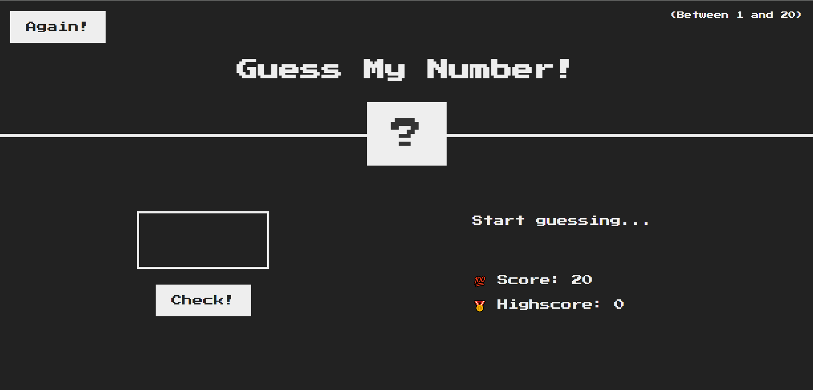

# 🎯 Guess My Number

A fun and interactive JavaScript game where you try to guess a randomly generated secret number between 1 and 20.  
Built using **HTML**, **CSS**, and **JavaScript** to practice DOM manipulation, event handling, and game logic.

---

## 📸 Screenshots

---

## 🕹️ How to Play

1. The game generates a **random secret number** between 1 and 100.
2. Enter your guess in the input box and click **Check**.
3. You will get hints whether your guess is **too high** 📈 or **too low** 📉.
4. Each wrong guess decreases your **score**.
5. Try to guess the number before your score reaches 0.
6. Click **Again** 🔄 to reset the game and play again.

---

## ✨ Features

- Random number generation using `Math.random()`.
- Dynamic UI updates using `textContent` and CSS styling.
- Score tracking and high score saving.
- **Responsive design** for different screen sizes.
- **Play Again** button to reset the game easily.

---

## 🧠 Concepts Practiced

- DOM manipulation with `querySelector()` and `addEventListener()`
- Conditional statements and logic building
- Functions and event-driven programming
- Template literals
- Styling updates dynamically using JavaScript

---

## 🚀 Live Demo

🔗 [**Play the Game Here**](https://amithsoni.github.io/guess-my-number/)  

---

## 📂 Project Structure
guess-my-number/
│── index.html
│── style.css
│── script.js

---

## 💡 How to Run Locally

1. Clone the repository:
   git clone https://github.com/your-username/guess-my-number.git

2. Open index.html in your browser.

3. Enjoy the game! 🎉

📜 License
This project is open source and available under the MIT License.

🙌 Acknowledgements
Inspired by the "Guess My Number" game from Jonas Schmedtmann's JavaScript course.

